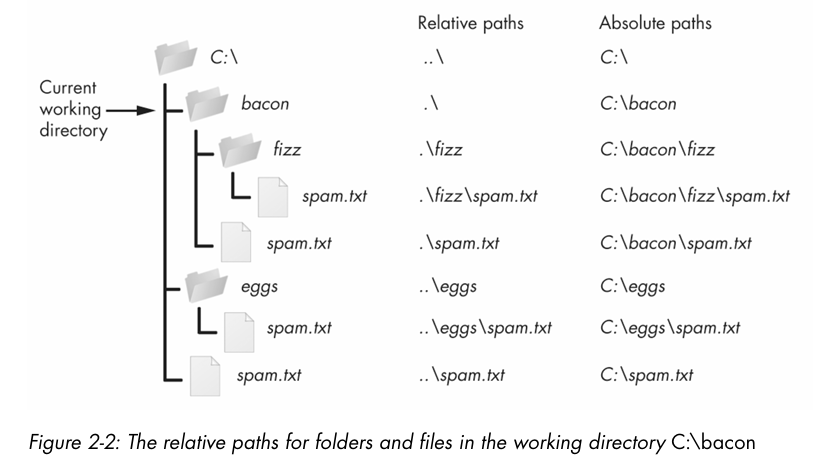

## Absolute vs Relative Paths
- **Absolute**: always begins with the root folder
- **Relative**: relative to the program's ``cwd``
- ``.\``- shorthand for "this directory"
- ``..\``- means "the parent folder"

